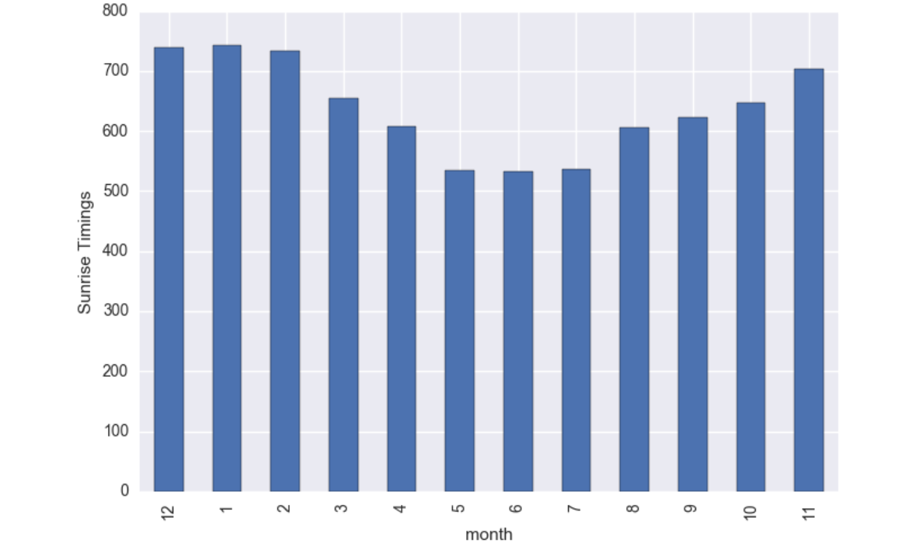

# Pipelining_Weather_Data

- Data can be dowloaded from https://www.ncdc.noaa.gov/cdo-web/datatools/lcd by selecting Texas state and the dates

# Instruction to get the image:

- To get the images in the local execute: 
   - docker pull sumedh11/assign1adssummer:latest
   - docker pull sumedh11/assign1part2adssummer:latest
   
## Building Part1 using Dockerfile1 and pushing to Dockerhub 

-Create an account in Dockerhub and a repository to push the image
 Repository name here is assign1adssummer

-Set Working Directory to the folder containing only  Part1 and Dockerfile1

-docker build -t image1 .

-Publishing an image to docker Hub

-Create a docker hub account, create a repository

-Connect to your account
docker login

-Tag your image to be pushed with repository
docker tag image1 sumedh11/assign1adssummer:latest

-Push your image o docker hub
docker push sumedh11/assign1adssummer:latest

## Building Part2 using Dockerfile2 and pushing to Dockerhub 

-Create a new Repository to push image for part2
 Repository name here is assign1part2adssummer

-Set Working Directory to the folder containing only  Part2 and Dockerfile2

-docker build -t image2 .

-Publishing an image to docker Hub

-Create a docker hub account, create a repository

-Connect to your account
docker login

-Tag your image to be pushed with repository
docker tag image2 sumedh11/assign1part2adssummer:latest

-Push your image to docker hub
docker push sumedh11/assign1part2adssummer:latest

## Running Part1 and Part2 at once using makefile
-Execute the following command by going into the directory containing Part1,Part2,makefile
-make -f makefile

# Insights in EDA before cleansing vs after cleansing

## Analysis1:
Maximum aggregate Dry bulb Temperature on monthly basis:

- We can observe from the graph that the maximum temperature was in 5th i.e. May month and minimum Dry bulb temp in 2nd i.e. February month
#### After cleansing

- As we can see the Data was consistent over the period of years so there is not much difference we can observe in this graph and the one above for before cleansing

## Analysis2:
Maximum aggregate Hourly Windspeed on monthly basis:

- We can observe from the graph that the maximum Windspeed was in 5th i.e. May month and minimum Dry bulb temp in 7th i.e. July month
#### After cleansing

- As we can see the Data was consistent over the period of years so there is not much difference we can observe in this graph and the one above for before cleansing

## Analysis3:
Maximum aggregate Windspeed on periodic basis:

time          | period
------------- | -------------
0 am - 4am    | late_night
4 am - 8am    | early_morning
8 am - 12am   | morning
12 pm - 4pm   | afternoon
4 pm - 8pm    | evening
8 pm - 12 am  | night

- The windspeed tends to be maximum at the morning time and least at night time that we can infer from this analysis

#### After cleansing

- The windspeed tends to be maximum at the morning time i.e. 8am-12noon and least at evening time 4pm-8pm that we can infer from this analysis where as the least was at night time according to RAW data EDA

## Analysis4:
-The average time at which the sun rises in each month

- We can see how summer months have an early sunrise and winter month having a late sunrise which resembels to the reality of Nature. The earliest Sunset is in June month with 5.32 AM while the month with latest is January with 7.42 AM.
#### After cleansing

- As we can see the Data was consistent over the period of years so there is not much difference we can observe in this graph and the one above for before cleansing

